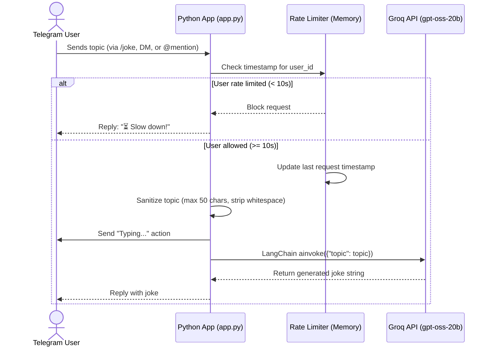
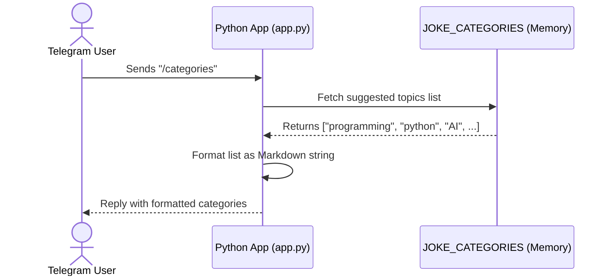
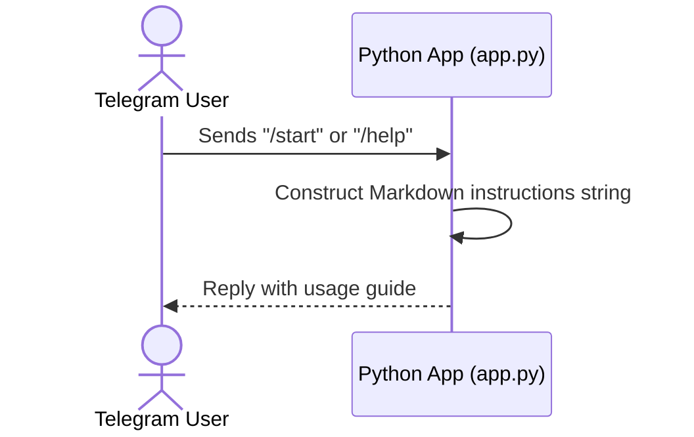

# 🤖 JokeEngine Bot

A Telegram bot that generates AI-powered jokes on any topic using OpenAI GPT-OSS 20B (via Groq) and LangChain.

## 🌟 Features & Data Flow

Below is exactly how each feature works, mapping the flow from the Frontend (Telegram) to the Backend (Python) and Data Layer (Groq API / Memory).

### 1. Joke Generation (`/joke`, DM, or `@mention`)
The core feature routes user topics through an in-memory rate limiter, sanitizes the input, and queries the Groq LLM to generate a joke.



### 2. Suggested Categories (`/categories`)
Quickly retrieves a predefined list of joke topics from memory and sends them to the user.



### 3. Setup & Help (`/start` and `/help`)
Provides users with instructions on how to interact with the bot in DMs and groups.



---

## 🛠 Prerequisites

- Python 3.10+
- A Telegram Bot token from [@BotFather](https://t.me/BotFather)
- A Groq API key from [console.groq.com](https://console.groq.com)

## 🚀 Setup & Running Locally

1. **Clone the repository**
   ```bash
   git clone https://github.com/Senthuran-dev/Telegram-Bot.git
   cd Telegram-Bot
   ```

2. **Install dependencies**
   ```bash
   pip install -r requirements.txt
   ```

3. **Configure environment variables**
   ```bash
   cp .env.example .env
   ```
   Edit `.env` and fill in your API keys:
   ```env
   TELEGRAM_API_KEY=your_telegram_bot_token
   GROQ_API_KEY=your_groq_api_key
   ```

4. **Run the bot**
   ```bash
   python app.py
   ```

## 🌐 Deployment (Vercel Serverless Webhook)

This repository is configured to be deployed as a serverless function on Vercel.

1. Create a new project on [Vercel](https://vercel.com/) and connect your GitHub repository.
2. In the Vercel project settings, add the following Environment Variables:
   - `TELEGRAM_API_KEY`
   - `GROQ_API_KEY`
3. Deploy the project.
4. Once deployed, register your Vercel URL with Telegram by visiting this URL in your browser:
   `https://api.telegram.org/bot<YOUR_TELEGRAM_TOKEN>/setWebhook?url=https://<YOUR_VERCEL_APP>.vercel.app/api/webhook`

## 💻 Tech Stack

- **[python-telegram-bot](https://python-telegram-bot.org/)** - Telegram Bot API wrapper
- **[LangChain](https://www.langchain.com/)** - LLM orchestration
- **[Groq](https://groq.com/)** - Fast LLM inference
