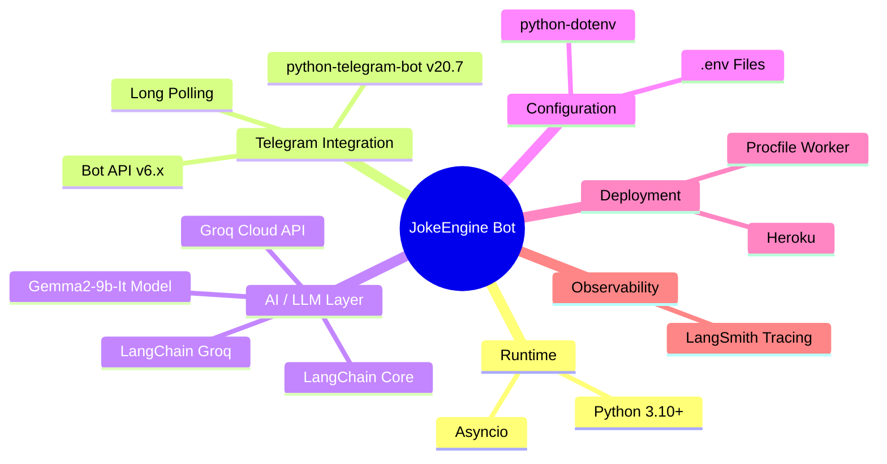
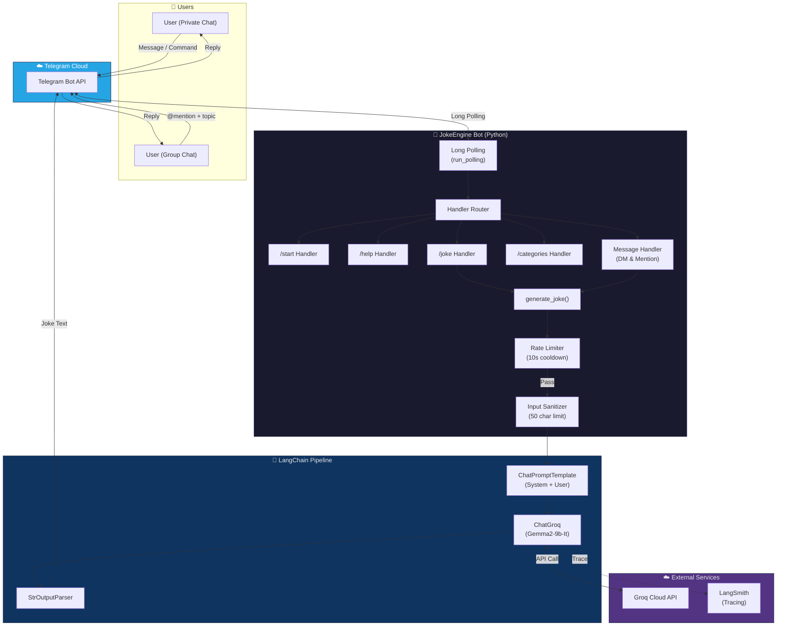
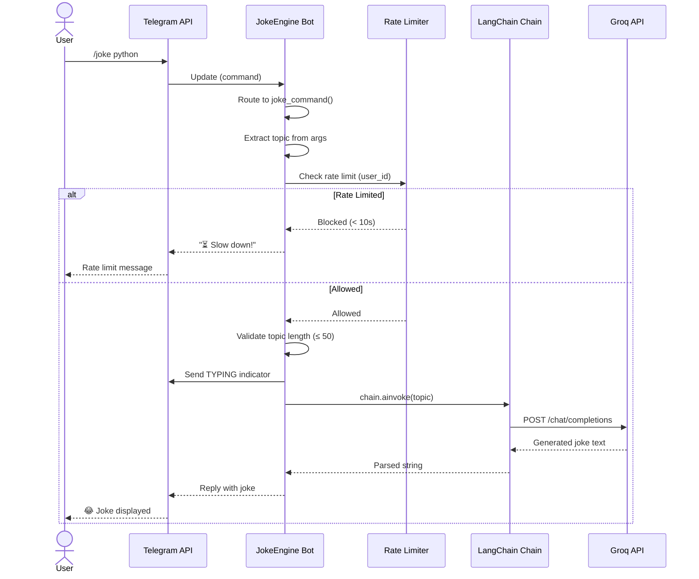
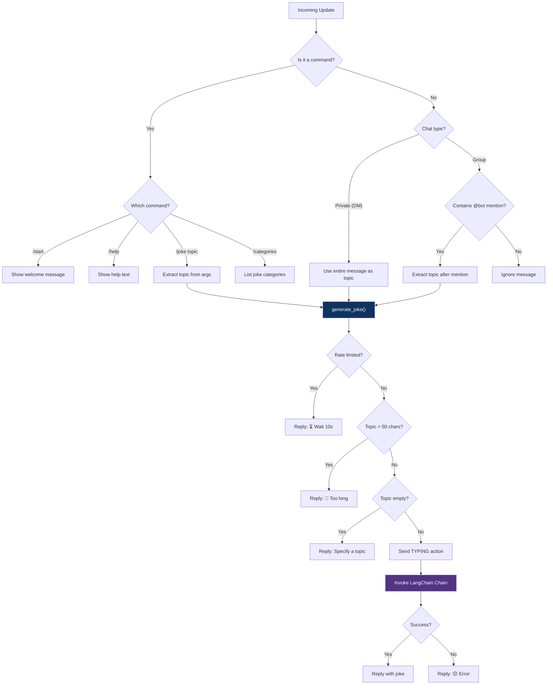
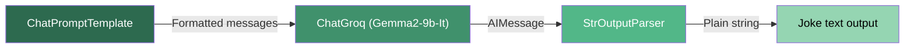
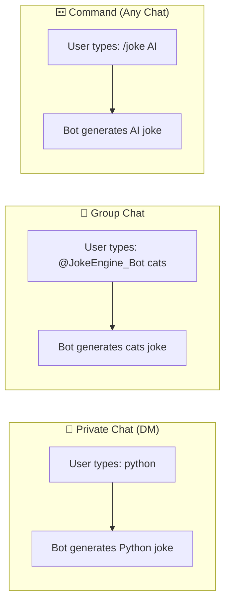
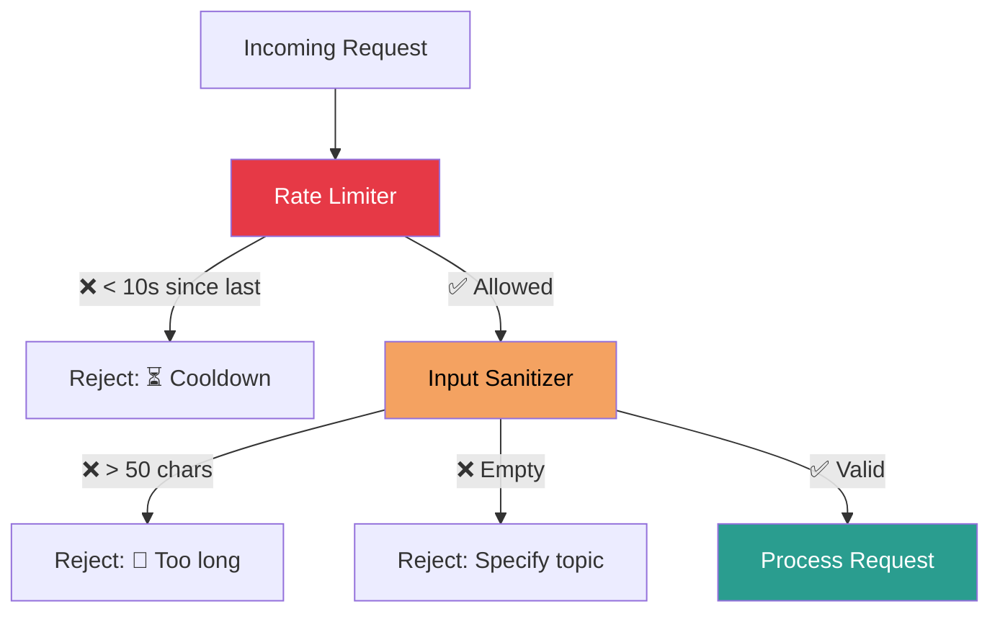
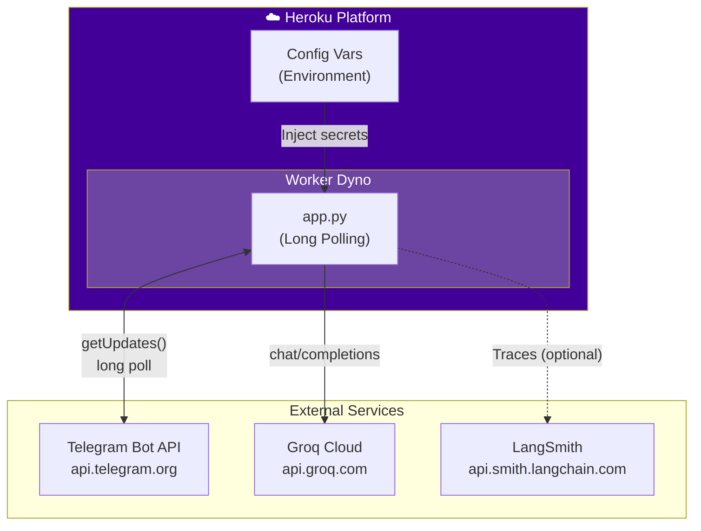
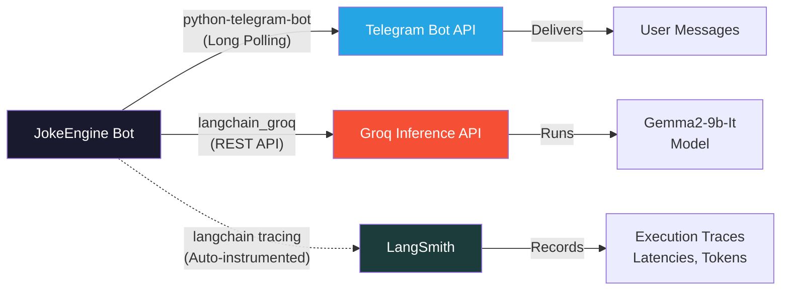

<div align="center">

# 🤖 JokeEngine Bot - Project Report

**An AI-powered Telegram Bot that generates contextual jokes on any topic using LLM inference**

[](https://python.org)
[](https://python-telegram-bot.org/)
[](https://www.langchain.com/)
[](https://groq.com/)
[](https://heroku.com/)

---

*A lightweight, production-ready Telegram chatbot that leverages Groq's ultra-fast LLM inference to deliver AI-generated jokes on demand - in both private chats and group conversations.*

</div>

---

## 📑 Table of Contents

- [Project Overview](#-project-overview)
- [Tech Stack & Dependencies](#-tech-stack--dependencies)
- [System Architecture](#-system-architecture)
- [Data Flow & Request Lifecycle](#-data-flow--request-lifecycle)
- [Project Structure](#-project-structure)
- [Module Breakdown](#-module-breakdown)
- [Bot Commands & Interaction Modes](#-bot-commands--interaction-modes)
- [Security & Rate Limiting](#-security--rate-limiting)
- [Configuration & Environment](#-configuration--environment)
- [Deployment Architecture](#-deployment-architecture)
- [API Integrations](#-api-integrations)
- [Design Decisions & Trade-offs](#-design-decisions--trade-offs)
- [Future Improvements](#-future-improvements)

---

## 📌 Project Overview

**JokeEngine Bot** is a Telegram chatbot that generates unique, AI-crafted jokes on any user-specified topic. It is built as a single-file Python application that integrates three major cloud services:

| Aspect | Detail |
|---|---|
| **Purpose** | Generate AI-powered jokes on any topic via Telegram |
| **Bot Handle** | `@JokeEngine_Bot` |
| **LLM Model** | Google Gemma2-9b-It (via Groq) |
| **Interaction** | Private DMs, group mentions, and slash commands |
| **Deployment** | Heroku (worker dyno, long-polling) |
| **Rate Limit** | 1 joke per 10 seconds per user |
| **Max Topic Length** | 50 characters |

---

## 🛠 Tech Stack & Dependencies

### Core Technology Map



### Dependency Breakdown

| Package | Version | Purpose | Role in Architecture |
|---|---|---|---|
| `python-telegram-bot` | `20.7` | Telegram Bot API wrapper | Handles all Telegram communication - receiving updates, sending messages, managing commands |
| `langchain` | Latest | LLM orchestration framework | Provides the chain abstraction (`prompt | llm | parser`) for composable AI pipelines |
| `langchain_core` | Latest | Core LangChain primitives | Supplies `ChatPromptTemplate` and `StrOutputParser` used to structure LLM input/output |
| `langchain_groq` | Latest | Groq LLM integration | Connects LangChain to Groq's inference API for ultra-low-latency model calls |
| `python-dotenv` | Latest | Environment variable loader | Reads `.env` file at startup to inject secrets (API keys, tokens) into `os.environ` |

### Language & Runtime

```
┌─────────────────────────────────────────────────────┐
│  Python 3.10+                                       │
│  ┌───────────────────────────────────────────────┐  │
│  │  asyncio event loop                           │  │
│  │  ┌─────────────────┐  ┌────────────────────┐  │  │
│  │  │ telegram.ext     │  │ langchain (async)  │  │  │
│  │  │ Application      │  │ ChatGroq.ainvoke() │  │  │
│  │  └────────┬────────┘  └────────┬───────────┘  │  │
│  │           │                    │               │  │
│  │           ▼                    ▼               │  │
│  │    Telegram API          Groq Cloud API        │  │
│  └───────────────────────────────────────────────┘  │
└─────────────────────────────────────────────────────┘
```

---

## 🏗 System Architecture

### High-Level Architecture Diagram



### Architectural Pattern

The bot follows a **Pipeline Architecture** combined with a **Command Pattern**:

| Pattern | Where Applied | Description |
|---|---|---|
| **Command Pattern** | Handler registration | Each bot command (`/start`, `/joke`, `/help`, `/categories`) is registered as a discrete handler via `CommandHandler` |
| **Pipeline / Chain Pattern** | LLM invocation | `ChatPromptTemplate → ChatGroq → StrOutputParser` forms a composable LCEL (LangChain Expression Language) chain |
| **Singleton** | LLM & Chain instances | The `llm` and `chain` objects are created once at module level and reused across all requests |
| **Middleware** | Rate limiting & sanitization | `is_rate_limited()` and input validation act as middleware before the LLM pipeline |

---

## 🔄 Data Flow & Request Lifecycle

### Joke Generation Flow



### Message Routing Logic



---

## 📁 Project Structure

```
Telegram-Bot/
│
├── app.py              # Main application - all bot logic (160 lines)
├── requirements.txt    # Python package dependencies (5 packages)
├── Procfile            # Heroku deployment config (worker dyno)
├── .env                # Environment variables with secrets (git-ignored)
├── .env.example        # Template for environment variables
├── .gitignore          # Git exclusion rules
├── README.md           # Quick-start documentation
└── REPORT.md           # This file - expanded project report
```

### File Analysis

| File | Lines | Size | Purpose |
|---|---|---|---|
| `app.py` | 160 | 5.7 KB | Entire application logic - handlers, LLM chain, rate limiting, routing |
| `requirements.txt` | 5 | 79 B | Dependency declarations for pip |
| `Procfile` | 1 | 23 B | Heroku worker process definition |
| `.env.example` | 7 | 190 B | Environment variable template for new developers |
| `.gitignore` | 4 | 30 B | Excludes `.env`, `__pycache__/`, `.pyc`, `.pyo` |
| `README.md` | 65 | 1.6 KB | Setup instructions and quick reference |

---

## 🔍 Module Breakdown

The entire application lives in a single file [`app.py`](file:///c:/github/Telegram-Bot/app.py) - organized into five logical sections:

### 1. Initialization & Configuration (Lines 1–21)

```python
# Imports, .env loading, environment variable setup
load_dotenv()
os.environ["LANGCHAIN_TRACING_V2"] = "true"  # Enable LangSmith observability
groq_api_key = os.getenv("GROQ_API_KEY")
```

**What it does:** Loads environment variables, configures LangSmith tracing, and validates that required API keys are present (fails fast with `ValueError` if missing).

---

### 2. LLM Pipeline Setup (Lines 22–30)

```python
llm = ChatGroq(model="Gemma2-9b-It", groq_api_key=groq_api_key)

prompt = ChatPromptTemplate.from_messages([
    ("system", "You are a Joking AI. Give me only ONE funny joke on the given topic."),
    ("user", "generate a joke on the topic: {topic}")
])

chain = prompt | llm | StrOutputParser()
```

**What it does:** Constructs a reusable LangChain LCEL chain:



| Component | Class | Role |
|---|---|---|
| **Prompt** | `ChatPromptTemplate` | Structures the system persona ("Joking AI") and user input with a `{topic}` variable |
| **Model** | `ChatGroq` | Sends the formatted prompt to Groq's API using the Gemma2-9b-It model |
| **Parser** | `StrOutputParser` | Extracts the raw string content from the LLM's `AIMessage` response |

---

### 3. Rate Limiting (Lines 32–51)

```python
RATE_LIMIT_SECONDS = 10
user_last_request: dict[int, float] = {}

def is_rate_limited(user_id: int) -> bool:
    now = time.time()
    last = user_last_request.get(user_id, 0)
    if now - last < RATE_LIMIT_SECONDS:
        return True
    user_last_request[user_id] = now
    return False
```

**Mechanism:** In-memory dictionary mapping `user_id → last_request_timestamp`. Simple, fast, and sufficient for a single-instance deployment.

---

### 4. Command Handlers (Lines 54–121)

| Handler | Function | Trigger | Description |
|---|---|---|---|
| `/start` | `start()` | `/start` command | Sends a welcome message with usage instructions |
| `/help` | `help_command()` | `/help` command | Displays detailed help with Markdown formatting |
| `/categories` | `categories_command()` | `/categories` command | Lists 15 pre-defined joke categories |
| `/joke <topic>` | `joke_command()` | `/joke` command | Extracts topic from command args and generates a joke |

---

### 5. Message Handler & Main (Lines 123–160)

The message handler implements **dual-mode routing**:

| Mode | Condition | Behavior |
|---|---|---|
| **Private Chat** | `chat_type == "private"` | Treats the entire message text as a joke topic |
| **Group Chat** | Message contains `@bot_username` | Extracts the topic from text following the mention using regex |

---

## 🎮 Bot Commands & Interaction Modes

### Commands

```
/start      → Welcome message with usage guide
/help       → Detailed help with Markdown formatting
/joke <t>   → Generate an AI joke about topic <t>
/categories → List 15 suggested joke topics
```

### Supported Joke Categories

| | | | | |
|---|---|---|---|---|
| 💻 Programming | 🐍 Python | 🌐 JavaScript | 🤖 AI | 🔬 Science |
| 🔢 Math | 📜 History | 🐾 Animals | 🍕 Food | ⚽ Sports |
| 🎬 Movies | 🎵 Music | 📱 Technology | 🏫 School | 💼 Work |

### Interaction Modes



---

## 🔒 Security & Rate Limiting

### Security Measures



| Layer | Mechanism | Purpose |
|---|---|---|
| **Rate Limiting** | Per-user cooldown (10s), in-memory `dict[int, float]` | Prevents API abuse and excessive Groq API calls |
| **Input Sanitization** | Topic length capped at 50 characters | Prevents prompt injection via excessively long inputs |
| **Empty Input Guard** | Checks for empty/whitespace topics | Avoids sending meaningless prompts to the LLM |
| **Error Handling** | Try/except around `chain.ainvoke()` | Catches and gracefully handles LLM API failures |
| **Secret Management** | `.env` file (git-ignored) + `python-dotenv` | API keys never committed to version control |
| **Fail-fast Validation** | `ValueError` on missing API keys at startup | Prevents the bot from running in a misconfigured state |

---

## ⚙️ Configuration & Environment

### Environment Variables

| Variable | Required | Source | Description |
|---|---|---|---|
| `TELEGRAM_API_KEY` | ✅ Yes | [@BotFather](https://t.me/BotFather) | Telegram bot authentication token |
| `GROQ_API_KEY` | ✅ Yes | [console.groq.com](https://console.groq.com) | Groq API key for LLM inference |
| `LANGCHAIN_API_KEY` | ❌ Optional | [smith.langchain.com](https://smith.langchain.com) | LangSmith API key for observability/tracing |
| `LANGCHAIN_PROJECT` | ❌ Optional | User-defined | LangSmith project name for organizing traces |

### Configuration Constants

| Constant | Value | Location | Purpose |
|---|---|---|---|
| `MAX_TOPIC_LENGTH` | `50` | `app.py:33` | Maximum allowed characters in a joke topic |
| `RATE_LIMIT_SECONDS` | `10` | `app.py:34` | Cooldown period between requests per user |
| `JOKE_CATEGORIES` | 15 items | `app.py:37-41` | Pre-defined suggested joke topics |
| `LANGCHAIN_TRACING_V2` | `"true"` | `app.py:17` | Enables LangSmith tracing for all LLM calls |

---

## 🚀 Deployment Architecture

### Heroku Deployment Model



**Key points:**
- Uses a **worker dyno** (not web) since the bot uses long polling, not webhooks
- The `Procfile` contains: `worker: python app.py`
- No web server or port binding required - the bot initiates outbound connections only
- Environment variables are set via `heroku config:set` or the Heroku dashboard

---

## 🔗 API Integrations

### Integration Map



| API | Protocol | Auth | Purpose |
|---|---|---|---|
| **Telegram Bot API** | HTTPS (Long Polling) | Bot Token | Receive user messages, send replies, typing indicators |
| **Groq Cloud API** | HTTPS (REST) | API Key | Run LLM inference on Gemma2-9b-It model |
| **LangSmith** | HTTPS (Auto-instrumented) | API Key | Optional observability - traces, latency, token usage |

---

## 💡 Design Decisions & Trade-offs

| Decision | Rationale | Trade-off |
|---|---|---|
| **Single-file architecture** | Simplicity for a focused, small-scope bot | Harder to scale if features grow significantly |
| **Long polling over webhooks** | Simpler deployment (no public URL/SSL needed) | Slightly higher latency than webhooks; continuous connection required |
| **In-memory rate limiting** | Zero dependencies, fast lookups | Resets on restart; no persistence across deployments |
| **Singleton LLM chain** | Avoids re-creating expensive objects per request | Cannot dynamically switch models at runtime |
| **Groq (Gemma2-9b-It)** | Ultra-low latency (~200ms inference) | Smaller model capacity vs. GPT-4 or Claude |
| **Synchronous .env loading** | Simple startup configuration | Not suitable for dynamic secret rotation |
| **No database** | No persistence needed for joke generation | Cannot track user history or favorite topics |
| **Worker dyno (Heroku)** | Appropriate for long-polling bots | Cannot serve HTTP requests (no web dashboard) |

---

## 🔮 Future Improvements

| Area | Enhancement | Complexity |
|---|---|---|
| **Persistence** | Add SQLite/PostgreSQL for joke history, user preferences | Medium |
| **Multi-model** | Support model switching (`/model gemma`, `/model llama`) | Low |
| **Webhooks** | Switch to webhook mode for lower latency in production | Medium |
| **Inline Queries** | Support Telegram inline mode (`@bot topic` from any chat) | Medium |
| **Multi-language** | Detect user language and generate jokes accordingly | Medium |
| **Joke Rating** | Let users rate jokes with 👍/👎 reaction buttons | Low |
| **Admin Dashboard** | Web UI for monitoring usage, popular topics, error rates | High |
| **Redis Rate Limiter** | Persistent rate limiting that survives restarts | Low |
| **Docker** | Containerize for consistent deployment across platforms | Low |
| **CI/CD** | GitHub Actions for automated testing and deployment | Medium |

---

<div align="center">

</div>
